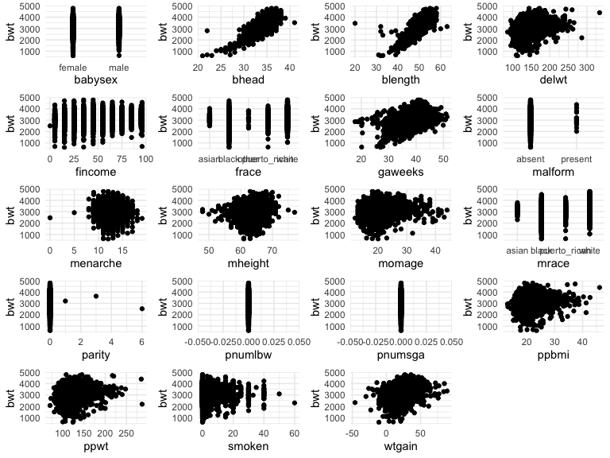
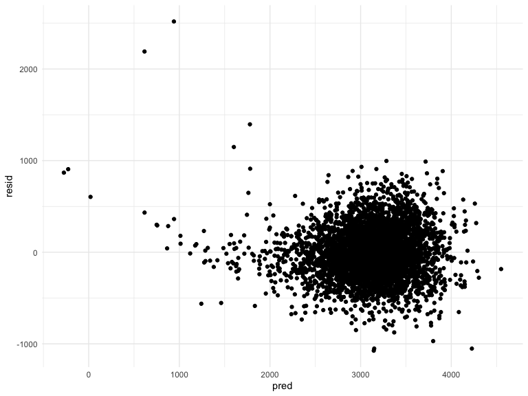
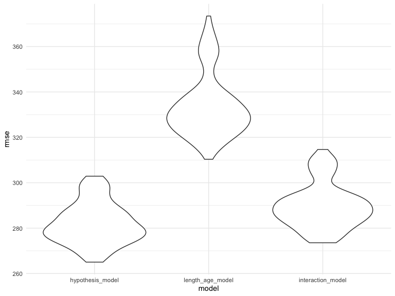
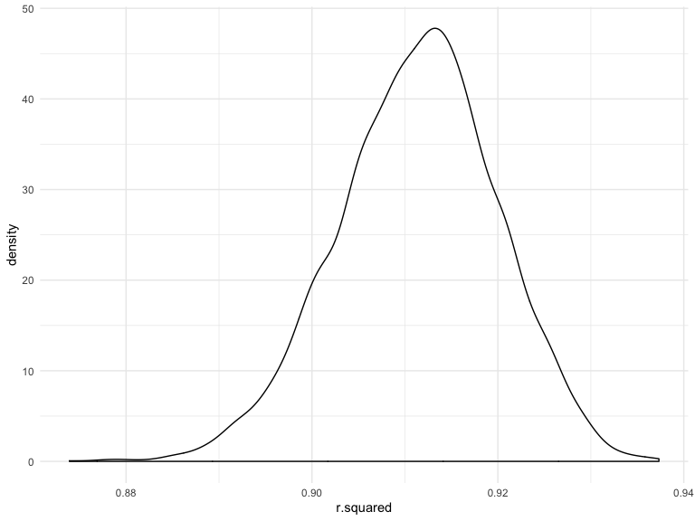
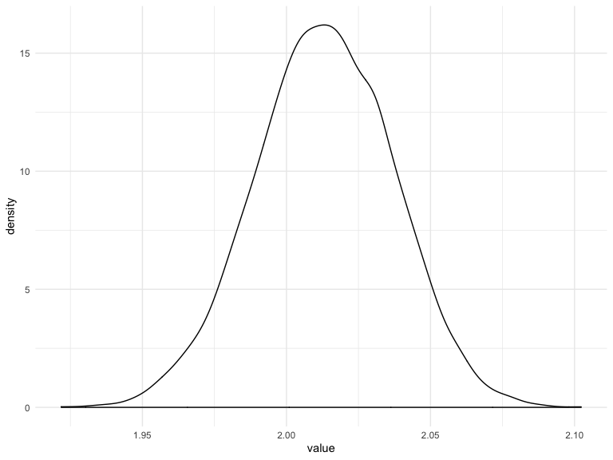

Homework 6
================
RuiJun Chen
11/25/2019

## Problem 1

``` r
birth_data = read_csv('./data/birthweight.csv') %>% janitor::clean_names()
```

    ## Parsed with column specification:
    ## cols(
    ##   .default = col_double()
    ## )

    ## See spec(...) for full column specifications.

``` r
#look for missing data
colSums(is.na(birth_data))
```

    ##  babysex    bhead  blength      bwt    delwt  fincome    frace  gaweeks 
    ##        0        0        0        0        0        0        0        0 
    ##  malform menarche  mheight   momage    mrace   parity  pnumlbw  pnumsga 
    ##        0        0        0        0        0        0        0        0 
    ##    ppbmi     ppwt   smoken   wtgain 
    ##        0        0        0        0

``` r
birth_data = 
  birth_data %>% 
  mutate(
    babysex = as.factor(if_else(babysex == 1, "male", "female")),
    frace = case_when(
      (frace == 1) ~ "white",
      (frace == 2) ~ "black",
      (frace == 3) ~ "asian",
      (frace == 4) ~ "puerto_rican",
      (frace == 8) ~ "other",
      (frace == 9) ~ "unknown",
    ),
    frace = as.factor(frace),
    mrace = case_when(
      (mrace == 1) ~ "white",
      (mrace == 2) ~ "black",
      (mrace == 3) ~ "asian",
      (mrace == 4) ~ "puerto_rican",
      (mrace == 8) ~ "other",
      (mrace == 9) ~ "unknown",
    ),
    mrace = as.factor(mrace),
    malform = as.factor(if_else(malform == 0, "absent", "present"))
  )
```

There is no missing data in any of the columns. The variables babysex,
frace, mrace, and malform were successfully converted into factor
variables.

Exploring the data by plotting everything:

``` r
par(mfrow = c(4, 5))

vars = birth_data %>% select(-bwt) %>% colnames()
plots = list()
for (i in 1:length(vars)) {
  plots[[i]] = ggplot(birth_data, aes_string(x = vars[i], y = "bwt")) + geom_point()
}
do.call(grid.arrange, plots)
```



From the scatter plots, seems that bhead, blength, delwt, gaweeks,
malform, momage, and wtgain appear most correlated with birth weight,
which we add to our hypothesis model

``` r
hypothesis_model = 
  lm(bwt ~ bhead + blength + delwt + gaweeks + malform + momage + wtgain, 
     data = birth_data)
all_model = lm(bwt ~ ., data = birth_data)
hypothesis_model %>% 
  broom::tidy() %>% 
  select(term, estimate, p.value) %>% 
  knitr::kable(digits = 4)
```

| term           |    estimate | p.value |
| :------------- | ----------: | ------: |
| (Intercept)    | \-6221.9223 |  0.0000 |
| bhead          |    134.0642 |  0.0000 |
| blength        |     78.6698 |  0.0000 |
| delwt          |      1.4885 |  0.0000 |
| gaweeks        |     12.9695 |  0.0000 |
| malformpresent |      8.2922 |  0.9093 |
| momage         |      6.2480 |  0.0000 |
| wtgain         |      2.5452 |  0.0000 |

``` r
all_model %>% 
  broom::tidy() %>% 
  select(term, estimate, p.value) %>% 
  knitr::kable(digits = 4)
```

| term               |    estimate | p.value |
| :----------------- | ----------: | ------: |
| (Intercept)        | \-6306.8346 |  0.0000 |
| babysexmale        |   \-28.7073 |  0.0007 |
| bhead              |    130.7781 |  0.0000 |
| blength            |     74.9536 |  0.0000 |
| delwt              |      4.1007 |  0.0000 |
| fincome            |      0.2898 |  0.1066 |
| fraceblack         |    \-6.9048 |  0.9302 |
| fraceother         |   \-16.9392 |  0.8622 |
| fracepuerto\_rican |   \-68.2323 |  0.3846 |
| fracewhite         |   \-21.2361 |  0.7593 |
| gaweeks            |     11.5494 |  0.0000 |
| malformpresent     |      9.7650 |  0.8900 |
| menarche           |    \-3.5508 |  0.2201 |
| mheight            |      9.7874 |  0.3426 |
| momage             |      0.7593 |  0.5344 |
| mraceblack         |   \-60.0488 |  0.4583 |
| mracepuerto\_rican |     34.9079 |  0.6663 |
| mracewhite         |     91.3866 |  0.2039 |
| parity             |     95.5411 |  0.0183 |
| ppbmi              |      4.3538 |  0.7700 |
| ppwt               |    \-3.4716 |  0.1839 |
| smoken             |    \-4.8544 |  0.0000 |

``` r
birth_data %>% 
  add_predictions(hypothesis_model) %>% 
  add_residuals(hypothesis_model) %>% 
  ggplot(aes(x = pred, y = resid)) + 
  geom_point()
```



``` r
length_age_model = lm(bwt ~ blength + gaweeks, data = birth_data)
interaction_model = lm(bwt ~ bhead + blength + babysex + bhead * blength + bhead * babysex +
                         blength * babysex + bhead * blength * babysex, data = birth_data)

cv_df = 
  crossv_mc(birth_data, 100) #%>% 
  #mutate(
  #  train = map(train, as_tibble),
  #  test = map(test, as_tibble)
  #)

cv_df =
  cv_df %>% 
  mutate(
    hypothesis_model = map(train, ~lm(bwt ~ bhead + blength + delwt + gaweeks + malform + 
                                        momage + wtgain, data = .x)), 
    #all_model = map(train, ~lm(bwt ~ ., data = .x)),
    length_age_model = map(train, ~lm(bwt ~ blength + gaweeks, data = .x)),
    interaction_model = map(train, ~lm(bwt ~ bhead + blength + babysex + bhead * blength + 
                                         bhead * babysex + blength * babysex + 
                                         bhead * blength * babysex, data = .x))
  ) %>% 
  mutate(
    rmse_hypothesis_model = map2_dbl(hypothesis_model, test, ~rmse(model = .x, data = .y)),
    #rmse_all_model = map2_dbl(all_model, test, ~rmse(model = .x, data = .y)),
    rmse_length_age_model = map2_dbl(length_age_model, test, ~rmse(model = .x, data = .y)),
    rmse_interaction_model = map2_dbl(interaction_model, test, ~rmse(model = .x, data = .y)),
    )

cv_df %>% 
  select(starts_with("rmse")) %>% 
  pivot_longer(
    everything(),
    names_to = "model",
    values_to = "rmse",
    names_prefix = "rmse_"
  ) %>% 
  mutate(model = fct_inorder(model)) %>% 
  ggplot(aes(x = model, y = rmse)) + geom_violin()
```



## Problem 2

``` r
weather_df = 
  rnoaa::meteo_pull_monitors(
    c("USW00094728"),
    var = c("PRCP", "TMIN", "TMAX"), 
    date_min = "2017-01-01",
    date_max = "2017-12-31") %>%
  mutate(
    name = recode(id, USW00094728 = "CentralPark_NY"),
    tmin = tmin / 10,
    tmax = tmax / 10) %>%
  select(name, id, everything())
```

    ## Registered S3 method overwritten by 'crul':
    ##   method                 from
    ##   as.character.form_file httr

    ## Registered S3 method overwritten by 'hoardr':
    ##   method           from
    ##   print.cache_info httr

    ## file path:          /Users/RayChen/Library/Caches/rnoaa/ghcnd/USW00094728.dly

    ## file last updated:  2019-10-14 01:14:10

    ## file min/max dates: 1869-01-01 / 2019-10-31

``` r
simple_model = lm(tmax ~ tmin, data = weather_df)
simple_model %>% broom::glance() %>% select(r.squared) %>% pull(1)
```

    ## [1] 0.9115425

``` r
temp = simple_model %>% broom::tidy() %>% select(estimate) %>% pull(1)
log(temp[1] * temp[2])
```

    ## [1] 2.013752

``` r
set.seed(1)

weather_results = 
  weather_df %>% 
  select(tmin, tmax) %>% 
  bootstrap(n = 5000) %>% 
  mutate(
    models = map(strap, ~lm(tmax ~ tmin, data = .x)),
    tidy_results = map(models, broom::tidy),
    glance_results = map(models, broom::glance)
  ) 

r_squares = weather_results %>% 
  select(glance_results) %>% 
  unnest(glance_results) %>% 
  select(r.squared) 

betas = weather_results %>% 
  select(tidy_results) %>% 
  unnest(tidy_results) %>% 
  select(estimate) %>% 
  pull(1)

log_vals = numeric(length(betas)/2)

for (i in seq(1, length(betas), 2)) {
  #print(i)
  #print(log_vals[(i+1)%/%2])
  log_vals[(i+1)/2] = log(betas[i] * betas[i+1])
  #print(log(betas[i] * betas[i+1]))
  #print(log_vals[(i+1)/2])
  #break
}
```

R-squared distribution and 95% CI. The distribution is largely normal
with a very slight left skew. Median is at 0.9118 with a 95% CI of
(0.8937,
0.9271)

``` r
r_squares %>% ggplot(aes(x = r.squared)) + geom_density()
```



``` r
summary(r_squares)
```

    ##    r.squared     
    ##  Min.   :0.8739  
    ##  1st Qu.:0.9057  
    ##  Median :0.9118  
    ##  Mean   :0.9113  
    ##  3rd Qu.:0.9171  
    ##  Max.   :0.9373

``` r
r_squares %>% pull(1) %>% quantile(c(.025, .975))
```

    ##      2.5%     97.5% 
    ## 0.8936684 0.9271060

Log of B0 and B1 distribution and 95% CI. The distribution is largely
normal with the median equal to the mean. Median (and mean) is at 2.013
with a 95% CI of (1.965, 2.059)

``` r
log_vals = as_tibble(log_vals)
log_vals %>% ggplot(aes(x = value)) + geom_density()
```



``` r
summary(log_vals)
```

    ##      value      
    ##  Min.   :1.922  
    ##  1st Qu.:1.997  
    ##  Median :2.013  
    ##  Mean   :2.013  
    ##  3rd Qu.:2.030  
    ##  Max.   :2.102

``` r
log_vals %>% pull(1) %>% quantile(c(.025, .975))
```

    ##     2.5%    97.5% 
    ## 1.964949 2.058887
